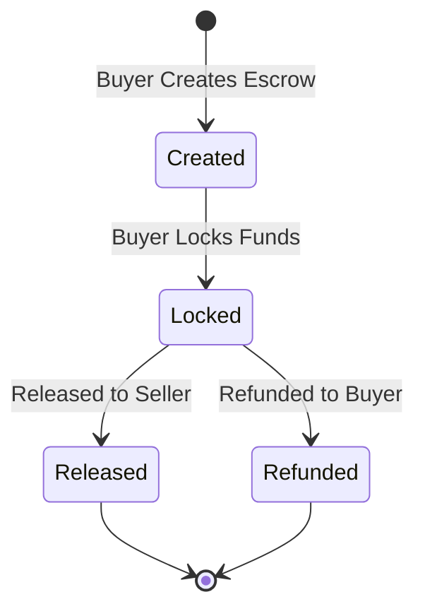

# PadiPay Soroban Escrow Contracts

Welcome to the **PadiPay Soroban Escrow Contracts** repository!

## Project Overview

PadiPay is a decentralized, Web2.5 escrow service designed specifically for informal markets. It bridges everyday traders to secure, transparent transactions without requiring them to understand the underlying blockchain technology.

This repository contains the core Soroban smart contracts that power the PadiPay escrow logic on the Stellar network.

## Current MVP Scope (v0.1.0)

The current milestone (v0.1.0) focuses on delivering a deployable **Happy Path MVP** on the Stellar Testnet.

It currently supports:
- Basic escrow creation
- Locking funds
- Releasing funds to the seller
- Refunding the buyer

*Note: Complex workflows like human-in-the-loop dispute resolution and milestone payments are deferred to future milestones.*

## Escrow Lifecycle

Below is the current lifecycle of an escrow in the MVP:



## Architecture Overview

The contract follows a modular architecture organized into several logical layers:
- **Escrow State:** Models the escrow agreement and status.
- **Storage Layer:** Manages persistent contract state using Soroban SDK.
- **Authentication Layer:** Ensures only authorized roles (Buyer, Seller) can perform sensitive actions.
- **Token Layer:** Safely manages locking, releasing, and refunding Stellar assets.
- **Event Layer:** Publishes key lifecycle events (e.g., `EscrowCreated`, `FundsLocked`) for off-chain applications.

For an in-depth look at the architecture, please see the [Architecture Document](docs/architecture.md).

## Local Development Instructions

To set up your environment for Soroban smart contract development:

### 1. Install Rust Toolchain
Install Rust using `rustup`:
```bash
curl --proto '=https' --tlsv1.2 -sSf https://sh.rustup.rs | sh
```
Add the WebAssembly target:
```bash
rustup target add wasm32-unknown-unknown
```

### 2. Install Stellar CLI
The `stellar` CLI is required to build, test, and deploy contracts.
```bash
cargo install --locked stellar-cli --features opt
```

### 3. Build the Contract
Compile the contract to WebAssembly:
```bash
stellar contract build
```
This will generate a `.wasm` file in the `target/wasm32-unknown-unknown/release/` directory.

For more details, see the [Setup Guide](docs/setup-guide.md).

## Testing Instructions

The repository includes a comprehensive suite of unit and integration tests covering the happy path, failure scenarios, and authorization checks.

Execute the tests locally by running:
```bash
cargo test
```
To verify the code formatting:
```bash
cargo fmt --all -- --check
```

## Roadmap Summary

PadiPay evolves incrementally. Here is a high-level view of our milestones:
- **v0.1.0 — Happy Path MVP:** Core escrow flow, tests, and basic CI *[Current]*
- **v0.2.0 — Contract Hardening:** Security, expirations, storage optimizations
- **v0.3.0 — Human Oracle:** Dispute resolution, mediators, oracle registry
- **v0.4.0 — Production Readiness:** Milestone payments, partial releases, protocol fees

Read the full plan in our [Roadmap](docs/roadmap.md).

## Related Repositories and Documentation

- [Contributing Guidelines](docs/contributing.md)
- [Architecture & State Flow](docs/architecture.md)
- [Setup Guide](docs/setup-guide.md)
- [Full Roadmap](docs/roadmap.md)
