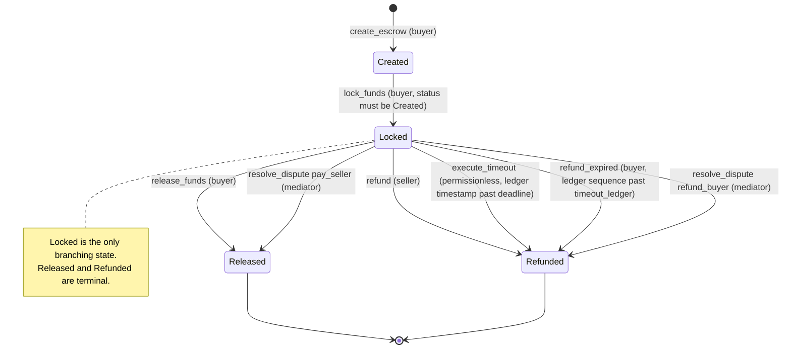

<div align="center">
  

  # PadiPay Contracts
  
  **"Trade with confidence, even with people you've never met."**

  [](https://opensource.org/licenses/MIT)
  [](https://nextjs.org/)
  [](https://soroban.stellar.org/)
</div>

<br />


# PadiPay Soroban Escrow Contracts

Welcome to the **PadiPay Soroban Escrow Contracts** repository!

## Project Overview

PadiPay is a decentralized, Web2.5 escrow service designed specifically for informal markets. It bridges everyday traders to secure, transparent transactions without requiring them to understand the underlying blockchain technology.

This repository contains the core Soroban smart contracts that power the PadiPay escrow logic on the Stellar network.

The contract implements an **Escrow Manager** architecture, meaning a single deployed contract is capable of managing many independent escrow agreements concurrently.

## Current Scope

The repository currently supports the **v0.2.0 Contract Hardening** milestone on the Stellar Testnet. For full release details, see the [Changelog](CHANGELOG.md).

It supports:
- Basic escrow creation
- Locking funds
- Time-locks / Expirations (`execute_timeout`)
- Releasing funds to the seller
- Refunding the buyer
- Dispute resolution with an authenticated mediator
- Emergency circuit breakers (pause/unpause)

*Note: Future milestone workflows like multi-mediator consensus and milestone payments are deferred to Phase C.*

## Escrow Lifecycle

The escrow is a strict state machine. It starts as a simple linear path (`Created → Locked`), then **branches** at `Locked`: the funds can move to the seller (`Released`) or back to the buyer (`Refunded`) through five different entrypoints, each with its own authorization and timing conditions. Every branch is gated by `EscrowStatus::is_valid_transition` and the guards in `src/validation.rs` / `src/contract.rs`.

Note that the contract manages many escrows simultaneously, and this lifecycle applies independently to each unique escrow agreement.


```mermaid
stateDiagram-v2
    [*] --> Created : create_escrow (buyer)
    Created --> Locked : lock_funds (buyer, status must be Created)

    Locked --> Released : release_funds (buyer)
    Locked --> Refunded : refund (seller)
    Locked --> Refunded : execute_timeout (permissionless, ledger timestamp past deadline)
    Locked --> Refunded : refund_expired (buyer, ledger sequence past timeout_ledger)
    Locked --> Released : resolve_dispute pay_seller (mediator)
    Locked --> Refunded : resolve_dispute refund_buyer (mediator)

    Released --> [*]
    Refunded --> [*]

    note right of Locked
        Locked is the only branching state.
        Released and Refunded are terminal.
    end note
```

### Branches out of `Locked`

| Entrypoint | Authorized by | Condition (see `src/contract.rs`) | Result |
| :--- | :--- | :--- | :--- |
| `release_funds` | Buyer | Happy path — buyer is satisfied | `Released` |
| `refund` | Seller | Happy path — seller cannot fulfil the order | `Refunded` |
| `execute_timeout` | Anyone (permissionless) | `env.ledger().timestamp() > deadline`, else `DeadlineNotReached` | `Refunded` |
| `refund_expired` | Buyer | `timeout_ledger` is `Some` (else `InvalidState`) **and** `env.ledger().sequence() > timeout_ledger` (else `DeadlineNotReached`) | `Refunded` |
| `resolve_dispute` | Mediator | `outcome == "pay_seller"` | `Released` |
| `resolve_dispute` | Mediator | `outcome == "refund_buyer"` (any other symbol → `InvalidState`) | `Refunded` |

> `execute_timeout` keys off the wall-clock `deadline` (ledger **timestamp**), while `refund_expired` keys off the `timeout_ledger` (ledger **sequence number**). They are independent expiry mechanisms.

## Architecture Overview

The contract follows a modular architecture organized into several logical layers:
- **Escrow Manager & State:** A single deployed contract manages multiple concurrent escrow agreements. Each agreement is tracked independently via a unique `EscrowId`.
- **Storage Layer:** Manages persistent contract state per escrow using the Soroban SDK.
- **Authentication Layer:** Ensures only authorized roles (Buyer, Seller, Mediator) can perform sensitive actions.
- **Token Layer:** Safely manages locking, releasing, and refunding Stellar assets.
- **Event Layer:** Publishes key lifecycle events (e.g., `EscrowCreated`, `FundsLocked`) for off-chain applications. Every event carries a schema version symbol (`v1`) as its second topic so indexers can filter by schema.
- **Admin Layer:** Provides emergency controls (`pause`, `unpause`) to mitigate zero-day risks.

For an in-depth look at the architecture, please see the [Architecture Document](docs/architecture.md).

## Local Development Instructions

To set up your environment for Soroban smart contract development:

### 1. Install Rust Toolchain
Install Rust using `rustup`:
```bash
curl --proto '=https' --tlsv1.2 -sSf https://sh.rustup.rs | sh
```
Add the WebAssembly target:
```bash
rustup target add wasm32v1-none
```

### 2. Install Stellar CLI
The `stellar` CLI is required to build, test, and deploy contracts.
```bash
cargo install --locked stellar-cli --features opt
```

### 3. Build the Contract
Compile the contract to WebAssembly:
```bash
stellar contract build
```
This will generate a `.wasm` file in the `target/wasm32v1-none/release/` directory.

For more details, see the [Setup Guide](docs/setup-guide.md).

## Testing Instructions

The repository includes a comprehensive suite of unit and integration tests covering the happy path, failure scenarios, and authorization checks.

Execute the tests locally by running:
```bash
cargo test
```
To verify the code formatting:
```bash
cargo fmt --all -- --check
```

## Deployment Instructions

To deploy the contract to the Stellar Testnet, please see the [Deployment Guide](docs/deployment.md) for detailed commands and necessary environment variables.

## Roadmap Summary

PadiPay evolves incrementally. Here is a high-level view of our milestones:
- **v0.1.0 — Happy Path MVP:** Core escrow flow, tests, and basic CI *[Completed]*
- **v0.2.0 — Contract Hardening:** Security, expirations, dispute resolution, circuit breaker *[Completed]*
- **v0.3.0 — Production Readiness (Phase C):** Milestone payments, partial releases, protocol fees, decentralized mediator registry *[Current]*

Read the full plan in our [Roadmap](docs/roadmap.md).

## Related Repositories and Documentation

- [Contributing Guidelines](docs/contributing.md)
- [Changelog](CHANGELOG.md)
- [Architecture & State Flow (MVP)](docs/architecture.md)
- [Long-Term Architectural Vision](docs/overallArchitecture.md)
- [Setup Guide](docs/setup-guide.md)
- [Full Roadmap](docs/roadmap.md)
