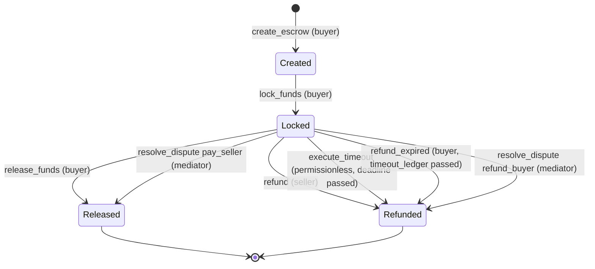
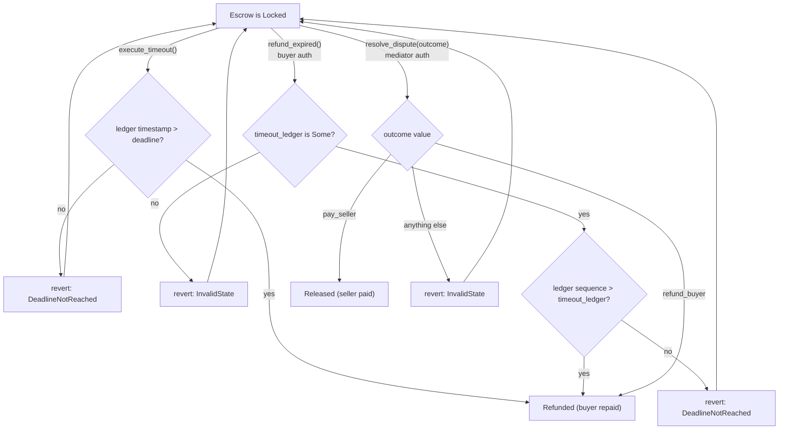

# PadiPay Smart Contract Architecture

This document describes the comprehensive architecture of the **PadiPay Soroban Escrow Contracts**. It covers the state machine, transaction authorization, timeout logic, dispute resolution, and lifecycle invariants.

---

## 1. Overview

The PadiPay contract acts as a trust-minimized **Escrow Manager**. It allows multiple buyers and sellers to safely exchange digital assets. The contract is designed around a strict state machine that guarantees deterministic outcomes for all parties, regardless of whether a transaction succeeds smoothly, times out, or enters a dispute.

### Why this architecture?
We chose a single multi-escrow contract rather than deploying a new contract instance per escrow. This optimizes deployment costs, simplifies the relayer API, and allows all escrows to share a single nonce-based storage layout. 

---

## 2. Escrow Lifecycle & State Machine

Every escrow created on the PadiPay contract must strictly adhere to the defined lifecycle. Escrow states are mutated based on user actions and ledger time. 

### 2.1 The Complete State Flow

The lifecycle is linear until `Locked`, then branches. `Locked` is the only state
with multiple outgoing transitions; `Released` and `Refunded` are terminal.

Only three transitions are legal in `EscrowStatus::is_valid_transition`
(`Created → Locked`, `Locked → Released`, `Locked → Refunded`); the six labelled
edges out of `Locked` above are the six entrypoints that each drive one of those
two branch transitions.

### 2.2 Valid Transitions

- **`Created` → `Locked`**
  - **Authorized by:** Buyer
  - **Why:** The buyer locks funds to indicate they are ready to proceed with the transaction.
- **`Locked` → `Released`**
  - **Authorized by:** Buyer (happy path) or Mediator (dispute path)
  - **Why:** To finalize the transaction and pay the seller. The buyer does this when satisfied; the mediator does this if ruling in favor of the seller.
- **`Locked` → `Refunded`**
  - **Authorized by:** Seller (happy path refund), Buyer (via timeout), or Mediator (dispute path)
  - **Why:** To return funds to the buyer. The seller does this if they cannot fulfill the order. The buyer does this if the deadline passes and the seller has not delivered. The mediator does this if ruling in favor of the buyer.

### 2.3 Invalid Transitions

- **`Created` → `Released` / `Refunded`**
  - **Why:** Funds cannot be distributed before they are actually locked in the contract.
- **`Locked` → `Created`**
  - **Why:** Once funds are committed, the contract cannot pretend the escrow was just created; it must either proceed to release or refund.
- **Any State → Same State**
  - **Why:** Prevents redundant processing and potential double-spend logic.
- **`Released` / `Refunded` → Any State**
  - **Why:** These are **terminal states**. Once funds are disbursed, the escrow lifecycle is irrevocably finished.

---

## 3. Advanced Flows

Beyond the happy path (`release_funds` / `refund`), a `Locked` escrow has three
non-cooperative exits: a wall-clock timeout, a ledger-sequence timeout, and a
mediated dispute. The diagram below maps each guard exactly as implemented in
`src/contract.rs`. A failed guard leaves the escrow in `Locked` (the call reverts
with the noted `Error`); it never advances the state.

### 3.1 Wall-Clock Timeout (`execute_timeout`)
- **Condition:** `env.ledger().timestamp() > state.deadline`, otherwise `DeadlineNotReached`.
- **Authorized by:** No `require_auth` — the call is **permissionless**, since the outcome is fully determined by ledger time and always favours the buyer.
- **Why it exists:** Without expirations, an unresponsive seller could trap the buyer's funds in the contract indefinitely. The `deadline` enforces a strict timeline for delivery.

### 3.2 Dispute Flow (`resolve_dispute`)
- **Condition:** Escrow is `Locked` (enforced by `is_valid_transition`). The `outcome` symbol must be exactly `pay_seller` (→ `Released`) or `refund_buyer` (→ `Refunded`); any other value reverts with `InvalidState`.
- **Authorized by:** The specific `mediator` address assigned at creation.
- **Why it exists:** If the buyer and seller cannot agree on a release or refund, the designated mediator has the ultimate authority to parse the dispute outcome and route funds to either the buyer (`Refunded`) or the seller (`Released`).

### 3.3 Ledger-Sequence Timeout (`refund_expired`)
- **Condition:** `state.timeout_ledger` must be `Some` (otherwise `InvalidState`) **and** `env.ledger().sequence() > timeout_ledger` (otherwise `DeadlineNotReached`).
- **Authorized by:** Buyer (`state.buyer.require_auth()`).
- **Why it exists:** `timeout_ledger` is an optional expiry set at creation (`create_escrow` rejects a value that is not strictly in the future). It is measured in **ledger sequence numbers** rather than wall-clock time, giving the relayer a deterministic, block-height-based refund path that is independent of `deadline`.

---

## 4. Authorization & Access Control

The contract validates authorization via Soroban's native `require_auth()` and strict role checks against the `EscrowState`.

| Action | Required Authorization | Justification |
| :--- | :--- | :--- |
| `create_escrow` | Buyer | Only the buyer can initiate the intent to lock their own funds. |
| `lock_funds` | Buyer | The buyer must cryptographically sign the actual token transfer to the contract. |
| `release_funds` | Buyer | Only the buyer can unilaterally decide they are satisfied and pay the seller. |
| `refund` | Seller | The seller can unilaterally decide to refund the buyer if they cannot fulfill the order. |
| `execute_timeout`| None (permissionless) | The outcome is fixed by ledger time and always refunds the buyer, so anyone may trigger it once `deadline` passes. |
| `refund_expired` | Buyer | Once the `timeout_ledger` sequence passes, the buyer is entitled to recover their funds. |
| `resolve_dispute`| Mediator | Only the trusted third-party can force a resolution during a conflict. |

---

## 5. Storage Model

Escrow data is stored using Soroban's persistent contract storage. 

- **EscrowId (`u64`)**: Derived from a globally incrementing nonce (`DataKey::EscrowNonce`). Guarantees unique IDs across the contract instance.
- **EscrowState**: Stored at `DataKey::Escrow(EscrowId)`. It contains the immutable parameters (`buyer`, `seller`, `token`, `amount`, `deadline`, `mediator`) and the mutable `status`.

**Storage Invariants:**
1. Once an `EscrowState` is created, its immutable parameters (buyer, seller, token, amount, deadline, mediator) must *never* be altered. Only the `status` may change.
2. The `EscrowNonce` strictly increments and never rolls back, preventing ID collisions.

---

## 6. Token Flow

Funds are managed via the Soroban Token Interface (`token::Client`). 

- The contract **never mints** assets.
- During `lock_funds`, the exact `amount` is transferred from the Buyer to the Contract Address.
- During `release_funds` or `refund`, the exact `amount` is transferred from the Contract Address to the Seller or Buyer, respectively.
- **Invariant:** The contract's internal balance must always exactly equal the sum of all `Locked` escrows' amounts.

---

## 7. Event Model

The contract emits structured events to allow off-chain applications (e.g., the PadiPay Relayer API) to observe escrow activity.

- `EscrowCreated`: Emitted on creation.
- `FundsLocked`: Emitted when the buyer transfers funds.
- `FundsReleased`: Emitted on a successful payout to the seller.
- `EscrowRefunded`: Emitted on a successful refund to the buyer (via happy path, timeout, or dispute).

All events include the `EscrowId`, `buyer`, and `seller` to facilitate efficient off-chain indexing and notification routing.