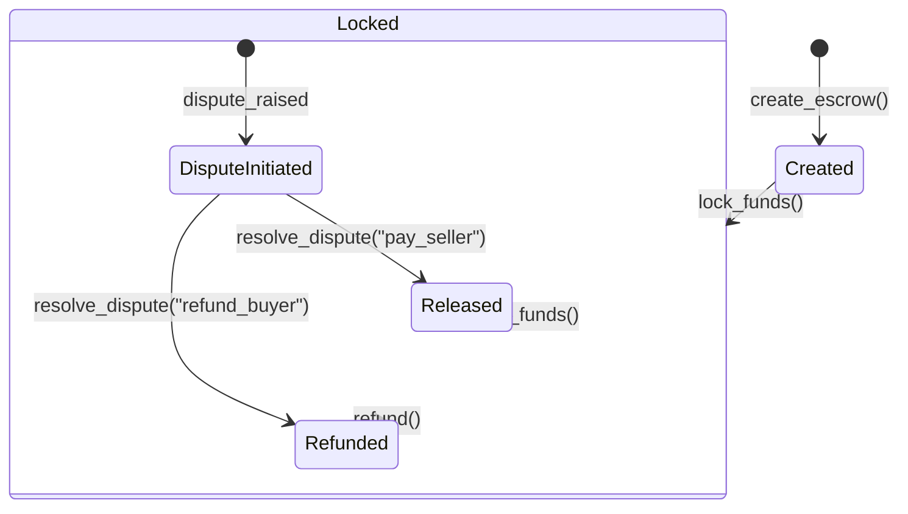

# PadiPay Escrow Smart Contract Developer & Architecture Guide

Welcome to the comprehensive technical documentation and architecture guide for the **PadiPay Escrow Smart Contract**. This contract acts as the decentralized trust layer of the PadiPay Web2.5 escrow service, facilitating secure, state-managed token deposits, locks, releases, refunds, and dispute resolutions on the Stellar network using Soroban.

---

## 1. Architectural Overview

PadiPay bridges Web2 convenience with Web3 security. While Web2 clients interact with friendly payment frontends, the actual custody and movement of value are governed by the Soroban smart contract.

```
       +---------------------------------------------+
       |             PadiPay Web2 Backend            |
       +---------------------------------------------+
                              |
      Trigger Escrow          | Transmit Transactions
      Creation/Updates        v (signed by keys)
       +---------------------------------------------+
       |          Soroban Smart Contract             |
       |       (soroban-escrow-contracts)            |
       +---------------------------------------------+
          |                  |                 |
          v                  v                 v
   +--------------+   +--------------+   +--------------+
   |  Depositor   |   |   Contract   |   |  Recipient   |
   | (Buyer Token |   |   Custody    |   | (Seller Token|
   |   Balance)   |   |   Balance    |   |   Balance)   |
   +--------------+   +--------------+   +--------------+
```

---

## 2. Escrow State Machine Lifecycle

Every escrow agreement has a well-defined lifecycle managed by the contract's internal state machine. This state machine guarantees that funds cannot be locked, released, or refunded outside of valid transition pathways.



### State Transitions Matrix

| Initial State | Target State | Trigger Function | Allowed? | Rationale / Conditions |
|---|---|---|---|---|
| `None` | `Created` | `create_escrow` | **Yes** | Initializes a new record with initial fields. |
| `Created` | `Locked` | `lock_funds` | **Yes** | Transitions state when buyer deposits the exact amount. |
| `Created` | `Released` | `release_funds` | **No** | Cannot release funds before they have been locked in the contract. |
| `Created` | `Refunded` | `refund` | **No** | Cannot refund since no funds have been deposited yet. |
| `Locked` | `Released` | `release_funds` | **Yes** | Releases custody balance to the seller's account. |
| `Locked` | `Refunded` | `refund` | **Yes** | Refunds custody balance back to the buyer's account. |
| `Released` | Any State | Any Function | **No** | Terminal state. No further actions allowed. |
| `Refunded` | Any State | Any Function | **No** | Terminal state. No further actions allowed. |

---

## 3. Data Storage Design

Soroban provides three storage types: **Instance**, **Temporary**, and **Persistent**. This contract employs a hybrid of **Instance** and **Persistent** storage to maintain balance between access speed, contract metadata persistence, and cost.

### Storage Keys (`DataKey`)

All stored state uses the `DataKey` enum to guarantee strong type safety and prevent namespace collisions.

```rust
pub enum DataKey {
    /// The global administrator or mediator of the contract.
    Admin,
    /// The escrow state associated with a specific escrow ID.
    Escrow(EscrowId),
    /// The nonce used to generate unique escrow IDs.
    EscrowNonce,
}
```

* **`DataKey::EscrowNonce`**: Stored in **Instance** storage. It tracks the global sequential index of created escrows. Since it is accessed on every single escrow creation, placing it in instance storage minimizes gas consumption.
* **`DataKey::Escrow(EscrowId)`**: Stored in **Persistent** storage. This maintains the complete state structure for an individual escrow. Placing it in persistent storage ensures it remains recoverable even if inactive, but subjects it to TTL rules.

### TTL (Time-To-Live) Strategy

Soroban requires developers to manage state expiration to prevent ledger bloat. The contract implements a proactive TTL extension strategy for every lifecycle action:

```rust
// ~30 days in ledgers (assuming 5 seconds per ledger)
const DAY_IN_LEDGERS: u32 = 17_280;
const INSTANCE_BUMP_AMOUNT: u32 = 30 * DAY_IN_LEDGERS;
const INSTANCE_LIFETIME_THRESHOLD: u32 = 14 * DAY_IN_LEDGERS;
const PERSISTENT_BUMP_AMOUNT: u32 = 30 * DAY_IN_LEDGERS;
const PERSISTENT_LIFETIME_THRESHOLD: u32 = 14 * DAY_IN_LEDGERS;
```

When any modifying function (`create_escrow`, `lock_funds`, `release_funds`, `refund`, or `resolve_dispute`) is executed, the contract automatically extends the TTL:
1. **Instance TTL**: Extended to the `INSTANCE_BUMP_AMOUNT` if it falls below the `INSTANCE_LIFETIME_THRESHOLD`.
2. **Persistent TTL**: The specific `DataKey::Escrow(id)` persistent record is extended to `PERSISTENT_BUMP_AMOUNT` if its lifetime is below `PERSISTENT_LIFETIME_THRESHOLD`.

This ensures active escrows never expire, while completed or stale ones can be safely archived if not bumped, keeping fees predictable and manageable.

---

## 4. API Function Reference

Below is the technical specification of the contract implementation.

### `create_escrow`

Initializes a new escrow agreement. Generates a new unique `EscrowId`.

* **Signature**:
  ```rust
  pub fn create_escrow(
      env: Env,
      buyer: Address,
      seller: Address,
      token: Address,
      amount: i128,
  ) -> Result<EscrowId, Error>
  ```
* **Authorization**: Requires authorization from `buyer` (`buyer.require_auth()`).
* **Validation Rules**:
  * `amount` must be strictly greater than zero (`Error::InvalidAmount`).
  * `buyer` and `seller` addresses must not be equal (`Error::InvalidAddresses`).
* **Storage Updates**: Writes `EscrowState` containing `Created` status. Increments the `EscrowNonce`.
* **Events Emitted**:
  * Topic: `(Symbol::new(&env, "EscrowCreated"), escrow_id)`
  * Data: `EscrowState`

### `lock_funds`

Locks the deposit amount from the buyer's balance into the contract's escrow custody.

* **Signature**:
  ```rust
  pub fn lock_funds(env: Env, escrow_id: EscrowId) -> Result<(), Error>
  ```
* **Authorization**: Requires authorization from the escrow's designated `buyer`.
* **Validation Rules**:
  * Escrow must exist in storage (`Error::EscrowNotFound`).
  * Current status must be `Created` (`Error::EscrowAlreadyFunded` or `Error::InvalidState`).
  * Must be a valid transition to `Locked`.
* **Token Operations**: Calls the transfer method of the configured token contract:
  ```rust
  token_client.transfer(&state.buyer, env.current_contract_address(), &state.amount);
  ```
* **Storage Updates**: Updates the escrow status field to `Locked`.
* **Events Emitted**:
  * Topic: `(Symbol::new(&env, "FundsLocked"), escrow_id)`
  * Data: `EscrowState`

### `release_funds`

Releases locked funds from the contract custody directly to the seller's account.

* **Signature**:
  ```rust
  pub fn release_funds(env: Env, escrow_id: EscrowId) -> Result<(), Error>
  ```
* **Authorization**: Requires authorization from the escrow's designated `buyer` to confirm receipt and allow release.
* **Validation Rules**:
  * Escrow must exist in storage (`Error::EscrowNotFound`).
  * Escrow status must be `Locked` (`Error::InvalidState`).
* **Token Operations**: Transfers funds from the contract to the seller:
  ```rust
  token_client.transfer(env.current_contract_address(), &state.seller, &state.amount);
  ```
* **Storage Updates**: Updates escrow status to `Released`.
* **Events Emitted**:
  * Topic: `(Symbol::new(&env, "FundsReleased"), escrow_id)`
  * Data: `EscrowState`

### `refund`

Allows the seller to return the locked funds back to the buyer (e.g. order cancelation/out-of-stock).

* **Signature**:
  ```rust
  pub fn refund(env: Env, escrow_id: EscrowId) -> Result<(), Error>
  ```
* **Authorization**: Requires authorization from the escrow's designated `seller` (`seller.require_auth()`).
* **Validation Rules**:
  * Escrow must exist in storage (`Error::EscrowNotFound`).
  * Escrow status must be `Locked` (`Error::InvalidState`).
* **Token Operations**: Transfers funds from the contract back to the buyer:
  ```rust
  token_client.transfer(env.current_contract_address(), &state.buyer, &state.amount);
  ```
* **Storage Updates**: Updates escrow status to `Refunded`.
* **Events Emitted**:
  * Topic: `(Symbol::new(&env, "EscrowRefunded"), escrow_id)`
  * Data: `EscrowState`

### `resolve_dispute`

Resolves a payment dispute between the buyer and seller.

* **Signature**:
  ```rust
  pub fn resolve_dispute(env: Env, escrow_id: EscrowId, mediator: Address, outcome: Symbol)
  ```
* **Authorization**: The mediator's signature will be checked here.
* **Outcome Options**:
  * `refund_buyer`: Transfers custody balance back to the `buyer` and sets status to `Refunded`.
  * `pay_seller`: Transfers custody balance to the `seller` and sets status to `Released`.
  * Any other outcome string triggers a panic (`Invalid outcome`).

---

## 5. Security & Verification Strategy

The contract's security rests on three core pillars:

1. **Explicit Signatures (`require_auth`)**: Every critical state transition requires cryptographic authorization from the appropriate party. The buyer must authorize deposit (`lock_funds`) and release (`release_funds`). The seller must authorize a voluntary refund (`refund`).
2. **Strict State Isolation**: Escrows are identified by unique `u64` IDs. Each lookup uses this ID directly in persistent storage, preventing any overlapping access or leakage.
3. **No Reentrancy Risk**: The contract follows the checks-effects-interactions pattern. Storage writes and checks occur before token transfers are executed.

---

## 6. Build, Format & Test Tooling

Use standard Cargo tools for contract development:

```bash
# Build the contract target
cargo build --release --target wasm32-unknown-unknown

# Run formatting checks
cargo fmt --all -- --check

# Apply formatting
cargo fmt --all

# Run the complete test suite (both unit tests and comprehensive scenarios)
cargo test
```
