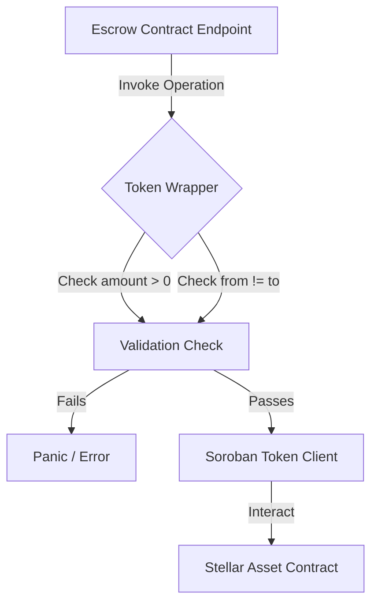

# Safe Token Abstraction Wrapper Guide

This developer guide describes the architecture, API, and safety considerations for the `PadiPay` token abstraction wrapper located in `src/token.rs`.

---

## 1. Overview

In Stellar Soroban contracts, interaction with token assets is performed using the `soroban_sdk::token::Client`. However, direct client usage often introduces repetitive boilerplate and security risks if verification checks are omitted.

The safe token abstraction wrapper acts as a centralized library for token operations. It wraps standard token operations with standard preconditions to prevent common vulnerabilities such as:
- **Zero-Value Transfers**: Prevents invoking token operations with 0 or negative amounts.
- **Self-Transfers**: Prevents transfers where `from == to`, which could lead to reentrancy or state inconsistencies depending on the underlying token contract implementation.
- **Consistent Event Emitted**: Centralizes token interaction logic to simplify auditing.

---

## 2. API Reference

The wrapper provides the following public functions:

### `get_token_client`
```rust
pub fn get_token_client<'a>(env: &'a Env, token: &Address) -> token::Client<'a>
```
Creates a default `soroban_sdk::token::Client` reference for the specified token contract address.

### `balance`
```rust
pub fn balance(env: &Env, token: &Address, owner: &Address) -> i128
```
Retrieves the balance of a specific owner.
- **Preconditions**: None.
- **Safety**: Safe to invoke for any valid `Address`.

### `allowance`
```rust
pub fn allowance(env: &Env, token: &Address, from: &Address, spender: &Address) -> i128
```
Retrieves the current remaining allowance granted by `from` to `spender`.

### `approve`
```rust
pub fn approve(
    env: &Env,
    token: &Address,
    from: &Address,
    spender: &Address,
    amount: &i128,
    expiration_ledger: u32,
)
```
Approves a spender to transfer up to `amount` tokens on behalf of `from` until `expiration_ledger` is reached.
- **Preconditions**:
  - `amount` must be non-negative (`>= 0`). Panics if a negative amount is passed.

### `transfer`
```rust
pub fn transfer(env: &Env, token: &Address, from: &Address, to: &Address, amount: &i128)
```
Executes a direct transfer from the sender (`from`) to the recipient (`to`).
- **Preconditions**:
  - `amount` must be strictly positive (`> 0`).
  - `from` and `to` must not be identical (`from != to`).
- **Safety**: Prevents zero/negative transfers and self-transfers at the wrapper layer.

### `transfer_from`
```rust
pub fn transfer_from(
    env: &Env,
    token: &Address,
    spender: &Address,
    from: &Address,
    to: &Address,
    amount: &i128,
)
```
Executes a transfer on behalf of the owner (`from`) using the allowance granted to the `spender`.
- **Preconditions**:
  - `amount` must be strictly positive (`> 0`).
  - `from` and `to` must not be identical (`from != to`).

---

## 3. Architecture Diagrams



---

## 4. Security Invariants and Integration Guide

### 4.1 Token Security Checklist
1. **Always use the Token Wrapper**: Avoid instantiating `token::Client::new` directly inside the main contract body.
2. **Handle Return Errors**: Any call to the token contract can panic if the client lacks sufficient balance or authorization.
3. **Verify Auth**: Ensure `from.require_auth()` is invoked in the caller context before invoking token wrapper operations.

### 4.2 Code Example

```rust
// Inside a contract method:
pub fn lock_funds(env: Env, escrow_id: EscrowId) -> Result<(), Error> {
    let mut state = require_escrow(&env, escrow_id)?;

    // Transfer from buyer to contract using centralized wrapper
    crate::token::transfer(
        &env,
        &state.token,
        &state.buyer,
        &env.current_contract_address(),
        &state.amount,
    );

    Ok(())
}
```

---

## 5. Maintenance and Upgrades

If the Soroban Token Standard receives future updates, updates should be localized entirely to `src/token.rs`. Caller files like `src/contract.rs` should not require refactoring as long as the public interface remains consistent.
